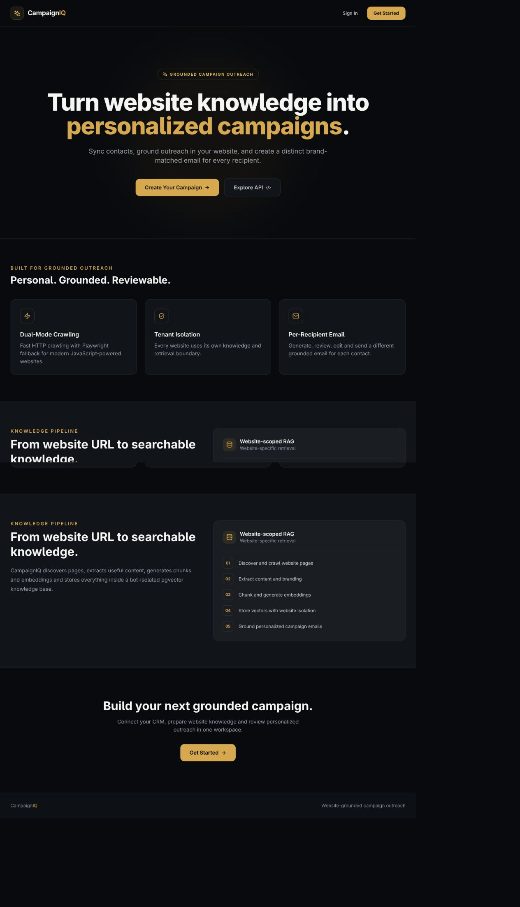
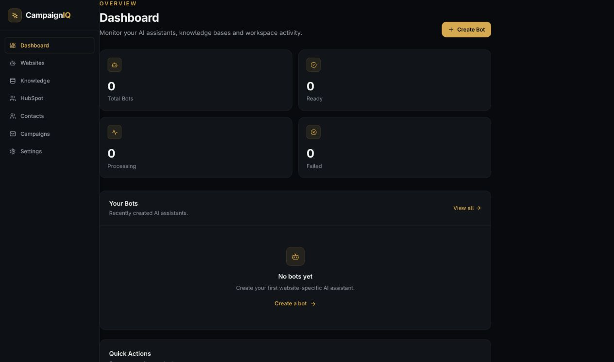
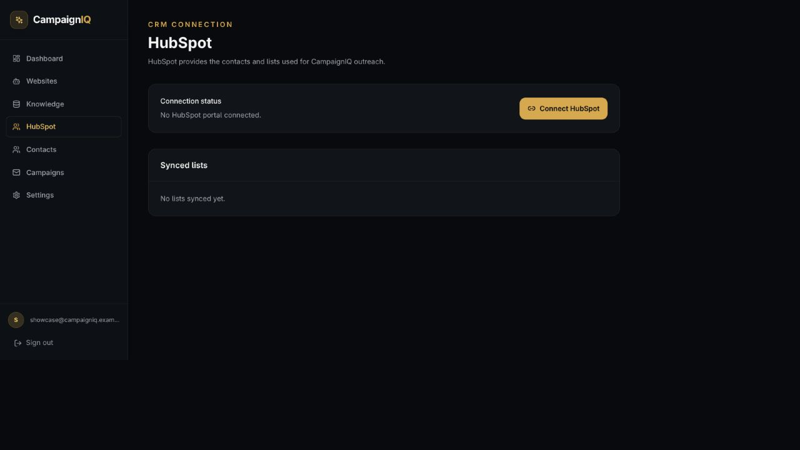

# CampaignIQ

> A grounded outreach workspace that connects CRM contacts with website
> intelligence to create personalized, reviewable campaign sequences.

CampaignIQ is a workspace for grounded, personalized campaign outreach:

`CampaignIQ auth → HubSpot CRM → website intelligence → campaign generation → review → external email delivery → scheduled follow-ups`

## Product preview

### Grounded outreach workspace

### Campaign workspace

### HubSpot CRM integration

CampaignIQ includes a dedicated HubSpot connection and sync workflow for CRM
contacts and lists. A HubSpot portal is not configured in this local showcase,
so the README presents the integration surface and its intended role without
claiming a live CRM connection.

## Repository layout

- `backend/` FastAPI, SQLAlchemy/Alembic, PostgreSQL/pgvector, Redis/Celery
- `frontend/` Next.js and Tailwind dashboard

## Intended workflow

1. Connect CampaignIQ to HubSpot and select the contacts for an outreach run.
2. Crawl and index website content to create a grounded intelligence layer.
3. Generate personalized campaign drafts from the CRM and site context.
4. Review and approve messages before external delivery.
5. Schedule follow-ups and track the campaign workflow from the dashboard.

## Local development

1. Copy `.env.example` to `.env` and provide required credentials.
2. Start PostgreSQL/pgvector and Redis with `docker compose up -d postgres redis`.
3. Run the backend from `backend/` with `uvicorn app.main:app --reload`.
4. Run the frontend from `frontend/` with `npm install && npm run dev`.

## What it includes

- Website intelligence that grounds campaign content in the business's public site
- HubSpot contact and list workflows for preparing outreach audiences
- Per-recipient campaign drafts, review controls, and follow-up scheduling
- A local development stack with FastAPI, Next.js, PostgreSQL/pgvector, and Redis
